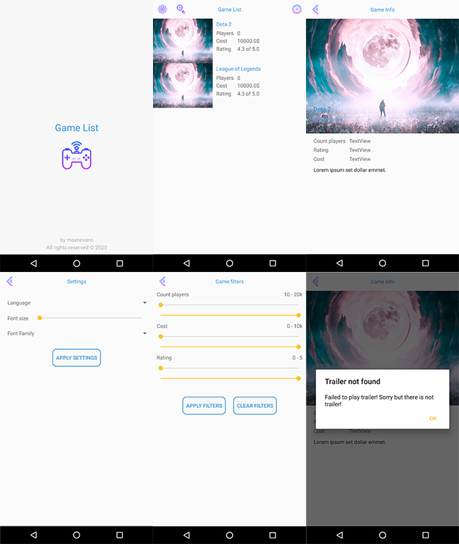

# Game List App - Official Anroid Application

Game list application is an application to create game list.

**Key features:**

- 2 types of Intent:
    - Splash screen (`intent.category.LAUNCHER`)
    - Explicit main intent
- Written fully in Kotlin
- Written for Android 6.0 (Marshmellow) and higher
- Uses animations similar to iOS default animations
- Supports laguanges:
    - Russian
    - English
- Supports font size changing
- Supports font family changing
- Working with Firebase Firestore and Storage

## Explore elegant and modern UI

## Copyrights

Designed and created by [maxnevans](https://github.com/maxnevans)

All rights reserved 2020 ©